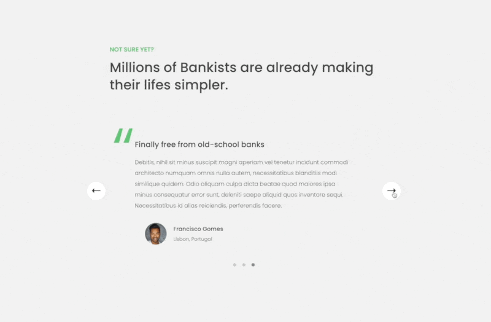

The project implements an app with a slider component.

It can be manipulated using the on-screen left and right buttons, the dots at the bottom of the slider or the left and right arrow keys when the slider is in the viewport.

## Demo

